# `crates/ggen-marketplace/tests/phase5_network_integration_test.rs`

Source SHA-256: `f7d5dfc1a9812f05092115a3948e5e932dd4b3e0fa5b82a35d0adbe1cbcd2f4f`

```mermaid
classDiagram
    class fn_test_client_creation_basic {
      <<fn>>
    }
    class fn_test_client_configuration_with_timeout {
      <<fn>>
    }
    class fn_test_client_configuration_with_cache {
      <<fn>>
    }
    class fn_test_default_timeout_is_reasonable {
      <<fn>>
    }
    class fn_test_registry_url_stored_correctly {
      <<fn>>
    }
    class fn_test_url_flexible_types {
      <<fn>>
    }
    class fn_test_builder_chaining_works {
      <<fn>>
    }
    class fn_test_offline_fallback_with_cache {
      <<fn>>
    }
    class fn_test_cache_initialization {
      <<fn>>
    }
    class fn_test_client_creation_offline {
      <<fn>>
    }
    class fn_test_client_with_unreachable_registry {
      <<fn>>
    }
    class fn_test_timeout_configuration_variants {
      <<fn>>
    }
    class fn_test_timeout_enforcement_framework {
      <<fn>>
    }
    class fn_test_package_metadata_structure {
      <<fn>>
    }
    class fn_test_package_metadata_serialization {
      <<fn>>
    }
    class fn_test_multiple_clients_independence {
      <<fn>>
    }
    class fn_test_client_state_immutability {
      <<fn>>
    }
```

## Dependencies

- `ggen_marketplace::marketplace::models::{PackageId, PackageVersion}`
- `ggen_marketplace::marketplace::network::MarketplaceClient`
- `ggen_marketplace::marketplace::network::PackageMetadata`
- `std::sync::Arc`
- `std::time::Duration`
- `tempfile::TempDir`

## Standing

- Structural parse: `ALIVE`
- Runtime behavior: `UNKNOWN`
