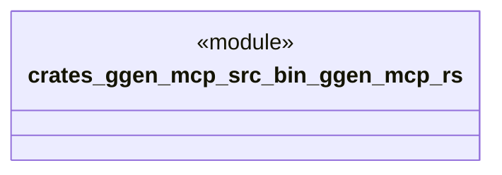

# `crates/ggen-mcp/src/bin/ggen-mcp.rs`

Source SHA-256: `f2057052cc21bf583f7066b8764c7fa7f461abf699020338c1d47bc578e2e309`

## Dependencies

- None observed.

## Standing

- Structural parse: `ALIVE`
- Runtime behavior: `UNKNOWN`
