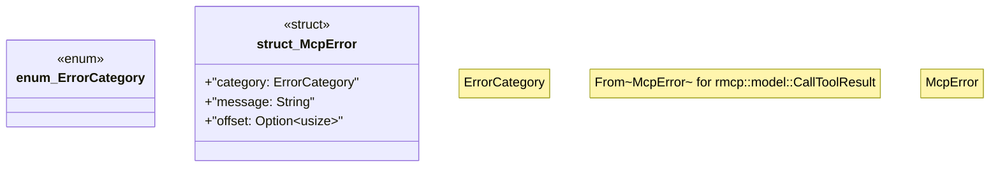

# `crates/ggen-mcp/src/error.rs`

Source SHA-256: `03a5106ad95cc34684dda09b99c466688976dddb43d22690345900719ccb8bf6`

## Dependencies

- `serde::Serialize`

## Standing

- Structural parse: `ALIVE`
- Runtime behavior: `UNKNOWN`
