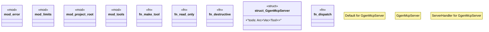

# `crates/ggen-mcp/src/lib.rs`

Source SHA-256: `84838197d2bce092918e5de72c4e553c95fdf8a81e843a115b39e7abb083737d`

## Dependencies

- `rmcp::ServiceExt`
- `rmcp::{model::*, service::RequestContext, ErrorData as McpError, RoleServer, ServerHandler}`
- `std::sync::Arc`

## Standing

- Structural parse: `ALIVE`
- Runtime behavior: `UNKNOWN`
