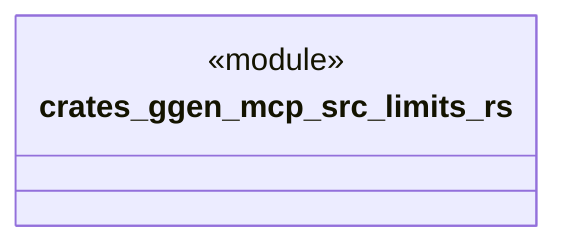

# `crates/ggen-mcp/src/limits.rs`

Source SHA-256: `878ff2057a55cfd033c0d86f40d5ab2ebda56e09ce228e1169f34e17ca650d14`

## Dependencies

- `ggen_engine::sync::MAX_QUERY_RESULT_ROWS`

## Standing

- Structural parse: `ALIVE`
- Runtime behavior: `UNKNOWN`
