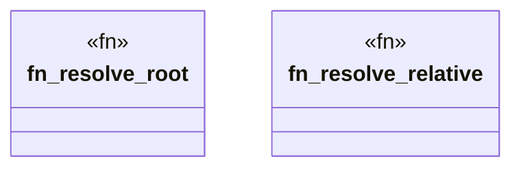

# `crates/ggen-mcp/src/project_root.rs`

Source SHA-256: `2f5a82c8771f6b2ab3b406eb13a84d62a267f38f7efc770449f4022f683eff43`

## Dependencies

- `crate::error::{ErrorCategory, McpError}`
- `crate::limits::MAX_PATH_BYTES`
- `std::path::{Path, PathBuf}`

## Standing

- Structural parse: `ALIVE`
- Runtime behavior: `UNKNOWN`
