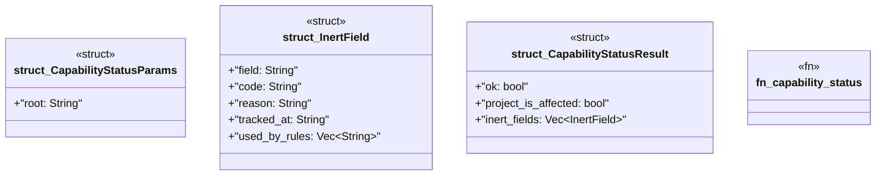

# `crates/ggen-mcp/src/tools/capability_status.rs`

Source SHA-256: `79cc4bbe5181f4716407198babf55356830ddcd2c2e867a959526ba92e43dc35`

## Dependencies

- `crate::error::{ErrorCategory, McpError}`
- `crate::project_root::resolve_root`
- `schemars::JsonSchema`
- `serde::{Deserialize, Serialize}`

## Standing

- Structural parse: `ALIVE`
- Runtime behavior: `UNKNOWN`
