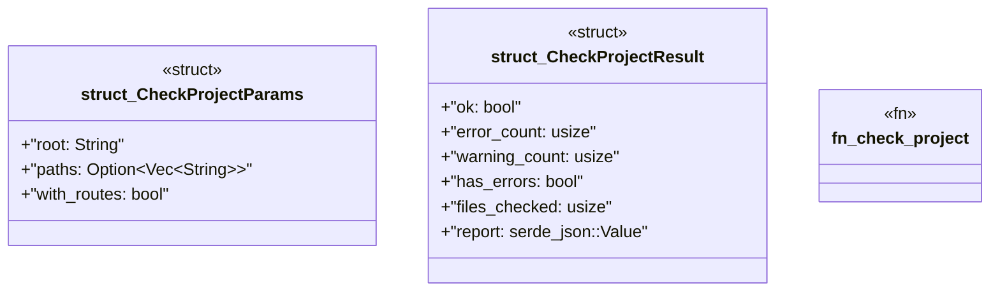

# `crates/ggen-mcp/src/tools/check_project.rs`

Source SHA-256: `b100ecd34b25d6dfa0da49741c3b4d5e2a7182e333a8e3c684a5a289bbb824c1`

## Dependencies

- `crate::error::{ErrorCategory, McpError}`
- `crate::project_root::{resolve_relative, resolve_root}`
- `schemars::JsonSchema`
- `serde::{Deserialize, Serialize}`

## Standing

- Structural parse: `ALIVE`
- Runtime behavior: `UNKNOWN`
