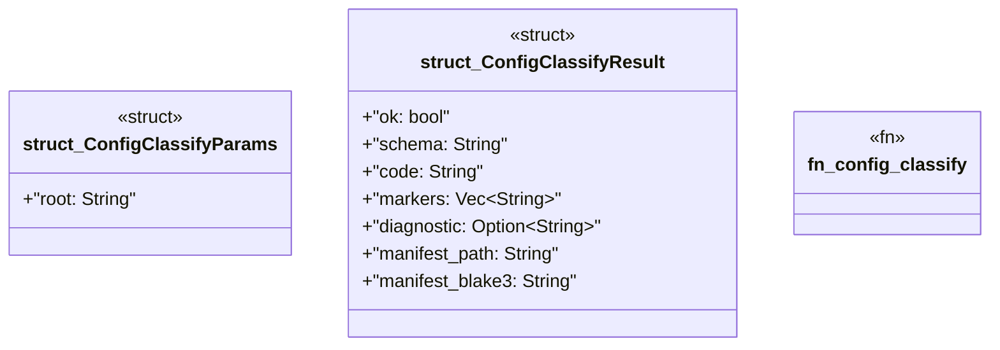

# `crates/ggen-mcp/src/tools/config_classify.rs`

Source SHA-256: `01439c9da2f2c3838e1a7a2c16723495ce6bac1fb01231a19f17faf3540cc89c`

## Dependencies

- `crate::error::{ErrorCategory, McpError}`
- `crate::project_root::resolve_root`
- `ggen_config::ConfigSchemaClassification`
- `schemars::JsonSchema`
- `serde::{Deserialize, Serialize}`

## Standing

- Structural parse: `ALIVE`
- Runtime behavior: `UNKNOWN`
