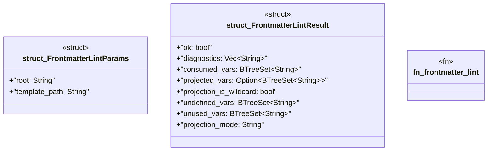

# `crates/ggen-mcp/src/tools/frontmatter_lint.rs`

Source SHA-256: `d81f3ee822f15f9aee84c814f69a83ee03a7b91a18b08ef909dfb90e73c50b01`

## Dependencies

- `crate::error::{ErrorCategory, McpError}`
- `crate::limits::MAX_QUERY_TEXT_BYTES`
- `crate::project_root::{resolve_relative, resolve_root}`
- `ggen_engine::lint::{consumed_vars, lint_template, projected_vars, Projection}`
- `ggen_engine::template::Template`
- `schemars::JsonSchema`
- `serde::{Deserialize, Serialize}`
- `std::collections::BTreeSet`

## Standing

- Structural parse: `ALIVE`
- Runtime behavior: `UNKNOWN`
