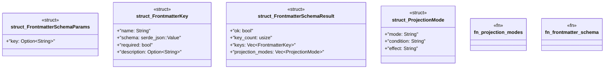

# `crates/ggen-mcp/src/tools/frontmatter_schema.rs`

Source SHA-256: `ca3feb47d4ae143999fb1472c7932e385fb580c8baf4079359e31a0cef7e0778`

## Dependencies

- `crate::error::McpError`
- `schemars::JsonSchema`
- `serde::{Deserialize, Serialize}`

## Standing

- Structural parse: `ALIVE`
- Runtime behavior: `UNKNOWN`
