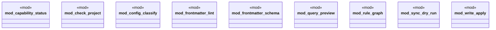

# `crates/ggen-mcp/src/tools/mod.rs`

Source SHA-256: `9f32021f526aa59ede225b0df4a041d04db1e7d2501bb64901bdde787e40c3a7`

## Dependencies

- None observed.

## Standing

- Structural parse: `ALIVE`
- Runtime behavior: `UNKNOWN`
