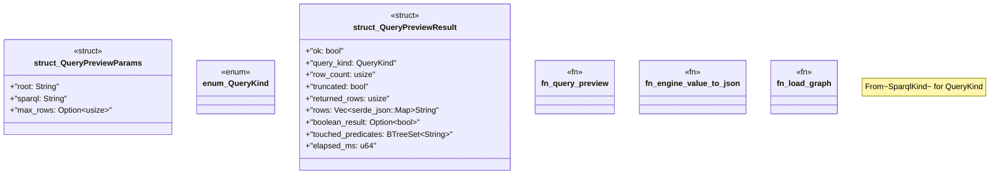

# `crates/ggen-mcp/src/tools/query_preview.rs`

Source SHA-256: `3203e5474f25fca2d933c59f4e2d1a22c95b5a1075305035b428a216cb462cdc`

## Dependencies

- `crate::error::{ErrorCategory, McpError}`
- `crate::limits::{MAX_QUERY_RESULT_ROWS, MAX_QUERY_TEXT_BYTES}`
- `crate::project_root::resolve_root`
- `ggen_engine::graph::{EngineQueryResults, EngineValue, GraphEngine}`
- `ggen_graph::sparql::{check_sparql_syntax, sparql_kind, SparqlKind}`
- `schemars::JsonSchema`
- `serde::{Deserialize, Serialize}`
- `std::collections::BTreeSet`
- `std::path::Path`

## Standing

- Structural parse: `ALIVE`
- Runtime behavior: `UNKNOWN`
