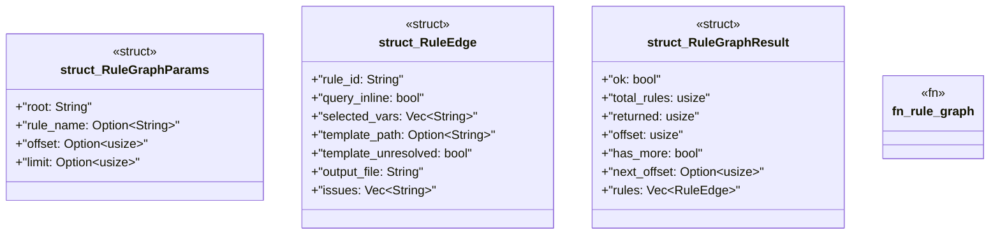

# `crates/ggen-mcp/src/tools/rule_graph.rs`

Source SHA-256: `92f49003fbabf11dfc9598bdf582ec4dfcb69cb5094fcefba9d2dceb2dd0c2a4`

## Dependencies

- `crate::error::{ErrorCategory, McpError}`
- `crate::project_root::resolve_root`
- `ggen_lsp::project_index::ProjectIndex`
- `schemars::JsonSchema`
- `serde::{Deserialize, Serialize}`

## Standing

- Structural parse: `ALIVE`
- Runtime behavior: `UNKNOWN`
