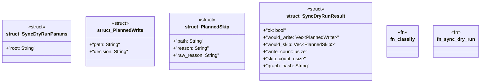

# `crates/ggen-mcp/src/tools/sync_dry_run.rs`

Source SHA-256: `19b3cc03bb6505a39fc62ba23c35abeb7cf4ca05c463d3e6e8fb048bddab65ed`

## Dependencies

- `crate::error::{ErrorCategory, McpError}`
- `crate::project_root::resolve_root`
- `ggen_engine::sync::{sync, SyncOptions}`
- `schemars::JsonSchema`
- `serde::{Deserialize, Serialize}`

## Standing

- Structural parse: `ALIVE`
- Runtime behavior: `UNKNOWN`
