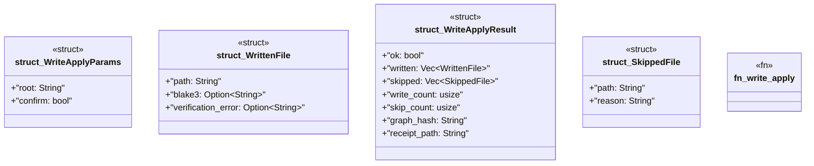

# `crates/ggen-mcp/src/tools/write_apply.rs`

Source SHA-256: `681f5ad0ca24e7b4c8cbffa93d98efa5261c9727b7055f7b1a931c4b35b7600c`

## Dependencies

- `crate::error::{ErrorCategory, McpError}`
- `crate::project_root::resolve_root`
- `ggen_engine::sync::{sync, SyncOptions}`
- `schemars::JsonSchema`
- `serde::{Deserialize, Serialize}`

## Standing

- Structural parse: `ALIVE`
- Runtime behavior: `UNKNOWN`
