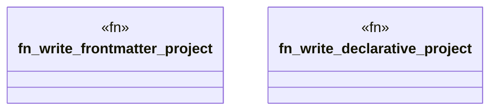

# `crates/ggen-mcp/tests/common/mod.rs`

Source SHA-256: `38b078232c8df826f5b8dd63f0bf351cc1443ba670cb63f8353c0d8e92edb10c`

## Dependencies

- `std::path::Path`

## Standing

- Structural parse: `ALIVE`
- Runtime behavior: `UNKNOWN`
