# `crates/ggen-mcp/tests/mcp_protocol_test.rs`

Source SHA-256: `3dbd7118d125b1949016705d13e03f787dc0a14e138e39a84da1725956df3bb4`

```mermaid
classDiagram
    class struct_McpClient {
      <<struct>>
      +"stdin: ChildStdin"
      +"rx: Receiver~Value~"
      +"child: Child"
      +"next_id: i64"
      +"tmp: TempDir"
    }
    class fn_handshake_advertises_identity_and_all_nine_tools {
      <<fn>>
    }
    class fn_tool_annotations_mark_exactly_one_destructive_tool {
      <<fn>>
    }
    class fn_query_preview_zero_rows_round_trips_over_the_wire {
      <<fn>>
    }
    class fn_query_preview_matching_rows_round_trips_over_the_wire {
      <<fn>>
    }
    class fn_malformed_query_returns_structured_error_over_the_wire {
      <<fn>>
    }
    class fn_unknown_tool_is_a_protocol_error {
      <<fn>>
    }
    class fn_frontmatter_schema_round_trips_and_surfaces_for_each {
      <<fn>>
    }
    note "Drop for McpClient"
    note "McpClient"
```

## Dependencies

- `serde_json::{json, Value}`
- `std::io::{BufRead, BufReader, Write}`
- `std::process::{Child, ChildStdin, Command, Stdio}`
- `std::sync::mpsc::{self, Receiver}`
- `std::thread`
- `std::time::Duration`
- `tempfile::TempDir`

## Standing

- Structural parse: `ALIVE`
- Runtime behavior: `UNKNOWN`
