# `crates/ggen-mcp/tests/pipeline_tools_test.rs`

Source SHA-256: `0ee21b0331c309ae81bebb659540a3c413f9fa6cd6a5815d72ba7158d1f47610`

```mermaid
classDiagram
    class mod_common {
      <<mod>>
    }
    class fn_snapshot {
      <<fn>>
    }
    class fn_collect {
      <<fn>>
    }
    class fn_dry_run_plans_a_write_without_touching_disk {
      <<fn>>
    }
    class fn_dry_run_skip_reasons_are_typed_and_preserve_raw_text {
      <<fn>>
    }
    class fn_write_apply_without_confirm_refuses_and_writes_nothing {
      <<fn>>
    }
    class fn_write_apply_writes_files_and_reports_verifiable_hashes {
      <<fn>>
    }
    class fn_write_apply_produces_the_receipt_it_reports {
      <<fn>>
    }
    class fn_write_apply_is_idempotent {
      <<fn>>
    }
    class fn_check_project_runs_and_reports_counts {
      <<fn>>
    }
    class fn_check_project_refuses_path_traversal_in_explicit_paths {
      <<fn>>
    }
```

## Dependencies

- `common::write_frontmatter_project`
- `ggen_mcp::error::ErrorCategory`
- `ggen_mcp::tools::{ check_project::{check_project, CheckProjectParams}, sync_dry_run::{sync_dry_run, SyncDryRunParams}, write_apply::{write_apply, WriteApplyParams}, }`
- `std::collections::BTreeMap`
- `std::path::{Path, PathBuf}`

## Standing

- Structural parse: `ALIVE`
- Runtime behavior: `UNKNOWN`
