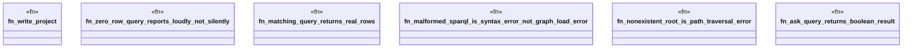

# `crates/ggen-mcp/tests/query_preview_test.rs`

Source SHA-256: `527c41b303de44f983702adecbb068086da5463a2a6c1a89da8fc371f14c415f`

## Dependencies

- `ggen_mcp::tools::query_preview::{query_preview, QueryPreviewParams}`
- `std::path::Path`

## Standing

- Structural parse: `ALIVE`
- Runtime behavior: `UNKNOWN`
