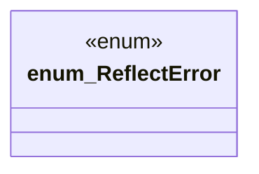

# `crates/openapi-cnv-reflect/src/error.rs`

Source SHA-256: `4164bd5da72e124c7eda43e1a1b0a8a84eae4e68cb0fb4c0903fa777a78fc0cb`

## Dependencies

- `thiserror::Error`

## Standing

- Structural parse: `ALIVE`
- Runtime behavior: `UNKNOWN`
