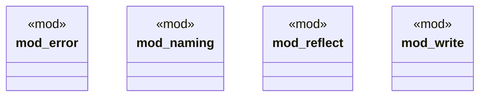

# `crates/openapi-cnv-reflect/src/lib.rs`

Source SHA-256: `a0066e21763145dfa01af8e921dcadabbb349bfa9fd72b028484257fa085ba41`

## Dependencies

- `error::ReflectError`
- `reflect::{reflect, ReflectOutcome, ReflectWarning}`
- `write::write_ontology`

## Standing

- Structural parse: `ALIVE`
- Runtime behavior: `UNKNOWN`
