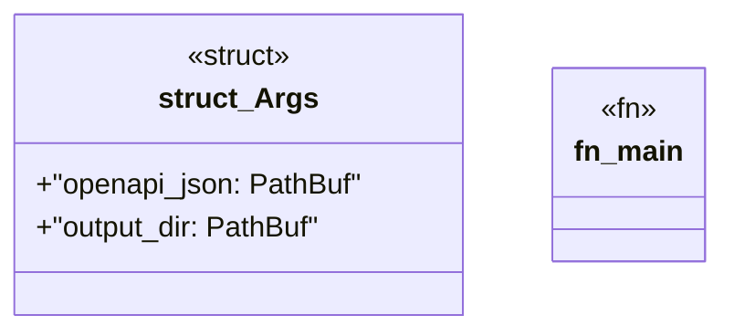

# `crates/openapi-cnv-reflect/src/main.rs`

Source SHA-256: `d85cae28ea75431a1e460444b677a8231f2cb37c2077f582e0f818da483f14fa`

## Dependencies

- `clap::Parser`
- `std::path::PathBuf`
- `std::process::ExitCode`

## Standing

- Structural parse: `ALIVE`
- Runtime behavior: `UNKNOWN`
