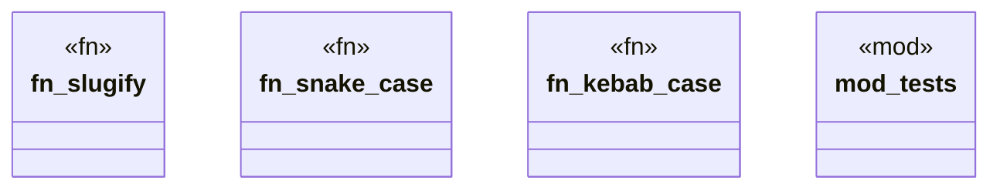

# `crates/openapi-cnv-reflect/src/naming.rs`

Source SHA-256: `6c8751630b7cf59249ecff8c67784cb0d8d465bc4daef378d2bd1ae16874c741`

## Dependencies

- `super::*`

## Standing

- Structural parse: `ALIVE`
- Runtime behavior: `UNKNOWN`
