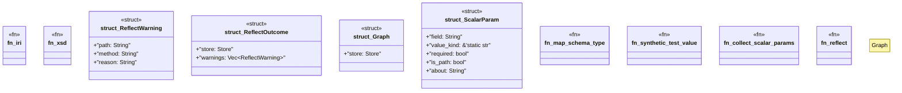

# `crates/openapi-cnv-reflect/src/reflect.rs`

Source SHA-256: `fbba244a2ce27789681934a432ddb4c12c922182509830565f36a4b2945c187b`

## Dependencies

- `crate::error::ReflectError`
- `crate::naming::{kebab_case, snake_case}`
- `oxigraph::model::{GraphNameRef, Literal, NamedNode, QuadRef}`
- `oxigraph::store::Store`
- `serde_json::Value`

## Standing

- Structural parse: `ALIVE`
- Runtime behavior: `UNKNOWN`
