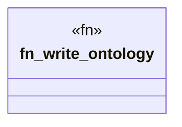

# `crates/openapi-cnv-reflect/src/write.rs`

Source SHA-256: `e16259718d99228fc8bbe6bef150dc12aac3cd0b2b636d50cb2df43982e7a2fe`

## Dependencies

- `crate::error::ReflectError`
- `oxigraph::io::RdfFormat`
- `oxigraph::model::GraphNameRef`
- `oxigraph::store::Store`
- `std::path::Path`

## Standing

- Structural parse: `ALIVE`
- Runtime behavior: `UNKNOWN`
