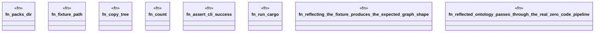

# `crates/openapi-cnv-reflect/tests/reflect_e2e.rs`

Source SHA-256: `e9f8349a4ab892963f4dada7a17b78b10c801a2b8712672f576af445ec8db971`

## Dependencies

- `chicago_tdd_tools::cli_proof::CliHarness`
- `oxigraph::sparql::{QueryResults, SparqlEvaluator}`
- `std::path::{Path, PathBuf}`
- `std::process::Command`
- `tempfile::TempDir`

## Standing

- Structural parse: `ALIVE`
- Runtime behavior: `UNKNOWN`
