# `crates/powl2-decompose/src/decompose.rs`

Source SHA-256: `8881513c095972c1ef0195be2703c5a67a47831e506d3a6e6d637937a01f34b3`

```mermaid
classDiagram
    class enum_RefusalReason {
      <<enum>>
    }
    class struct_Refusal {
      <<struct>>
      +"reason: RefusalReason"
      +"net_hash: String"
      +"separable: bool"
    }
    class fn_convert {
      <<fn>>
    }
    class fn_convert_with_budget {
      <<fn>>
    }
    class fn_non_free_choice_witness {
      <<fn>>
    }
    class fn_convert_rec {
      <<fn>>
    }
    class fn_convert_child {
      <<fn>>
    }
    class fn_base_case {
      <<fn>>
    }
    class struct_Groups {
      <<struct>>
      +"parent: BTreeMap~String"
    }
    class fn_partition_mg {
      <<fn>>
    }
    class fn_is_conflict_hiding {
      <<fn>>
    }
    class fn_execution_order {
      <<fn>>
    }
    class fn_transitive_closure {
      <<fn>>
    }
    class fn_partition_sm {
      <<fn>>
    }
    class fn_is_concurrency_hiding {
      <<fn>>
    }
    class fn_execution_flow {
      <<fn>>
    }
    class fn_places_touching {
      <<fn>>
    }
    class fn_project_mg {
      <<fn>>
    }
    class fn_project_sm {
      <<fn>>
    }
    class fn_normalize {
      <<fn>>
    }
    class fn_fresh {
      <<fn>>
    }
    class fn_uniq {
      <<fn>>
    }
    class fn_uniq_trans {
      <<fn>>
    }
    class fn_mg_makes_progress {
      <<fn>>
    }
    class fn_sm_makes_progress {
      <<fn>>
    }
    note "Groups"
    note "std::fmt::Display for Refusal"
    note "std::fmt::Display for RefusalReason"
```

## Dependencies

- `crate::net::WfNet`
- `crate::powl::{ChoiceGraph, GNode, Powl, END, START}`
- `serde::{Deserialize, Serialize}`
- `std::collections::{BTreeMap, BTreeSet}`

## Standing

- Structural parse: `ALIVE`
- Runtime behavior: `UNKNOWN`
