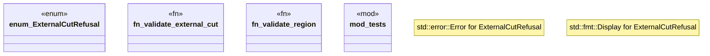

# `crates/powl2-decompose/src/external_cut.rs`

Source SHA-256: `1ffb96b121ee54a77df3ef7efa04ec826d45624b81956115b4d2a854110a45b2`

## Dependencies

- `crate::powl::Powl`
- `serde::{Deserialize, Serialize}`
- `super::*`

## Standing

- Structural parse: `ALIVE`
- Runtime behavior: `UNKNOWN`
