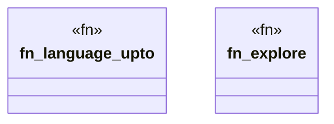

# `crates/powl2-decompose/src/language.rs`

Source SHA-256: `4623ecaac3b873f953cc90c885c4ae3d029c37ab5ff4969106af70b991308108`

## Dependencies

- `crate::net::WfNet`
- `crate::powl::Language`
- `std::collections::BTreeSet`

## Standing

- Structural parse: `ALIVE`
- Runtime behavior: `UNKNOWN`
