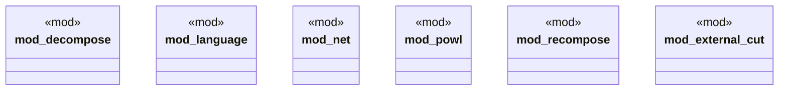

# `crates/powl2-decompose/src/lib.rs`

Source SHA-256: `796f42b56891c06b509a5dbfe956136208cba58e96ec47890f656c11db080727`

## Dependencies

- `decompose::{convert, convert_with_budget, Refusal, RefusalReason, DEFAULT_DEPTH_BUDGET}`
- `external_cut::{validate_external_cut, ExternalCutRefusal}`
- `net::{NetError, WfNet}`
- `powl::{ ChoiceGraph, GNode, Language, ParentChildClosure, ParentChildEdge, Powl, SocketKind, SocketPath, Trace, WorkflowSocketId, }`
- `recompose::recompose`

## Standing

- Structural parse: `ALIVE`
- Runtime behavior: `UNKNOWN`
