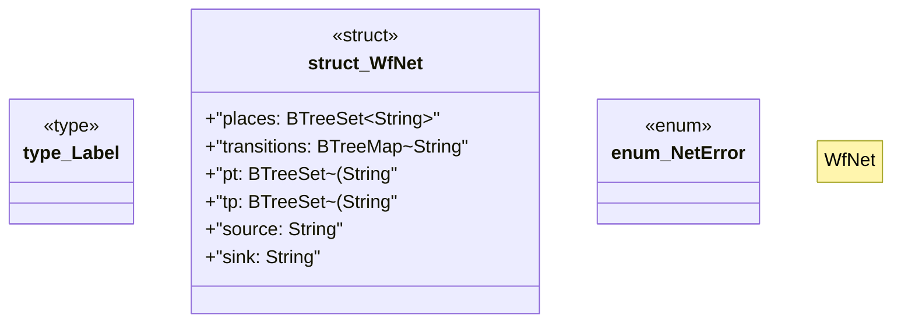

# `crates/powl2-decompose/src/net.rs`

Source SHA-256: `c3da7792f74dabd1bbb61e55b90ae9bea911612ed92468dbdf5b1afb01dfdcff`

## Dependencies

- `std::collections::{BTreeMap, BTreeSet, VecDeque}`

## Standing

- Structural parse: `ALIVE`
- Runtime behavior: `UNKNOWN`
