# `crates/powl2-decompose/src/powl.rs`

Source SHA-256: `498d4aa09c83e531800bd86bb6a9caa2e60d88917e9353a22b92bdcd10a91e40`

```mermaid
classDiagram
    class type_Trace {
      <<type>>
    }
    class type_Language {
      <<type>>
    }
    class struct_ChoiceGraph {
      <<struct>>
      +"n: usize"
      +"edges: BTreeSet~(GNode"
    }
    class enum_GNode {
      <<enum>>
    }
    class enum_Powl {
      <<enum>>
    }
    class struct_SocketPath {
      <<struct>>
    }
    class enum_SocketKind {
      <<enum>>
    }
    class struct_WorkflowSocketId {
      <<struct>>
      +"path: SocketPath"
      +"kind: SocketKind"
    }
    class struct_ParentChildEdge {
      <<struct>>
      +"parent: WorkflowSocketId"
      +"child: WorkflowSocketId"
    }
    class struct_ParentChildClosure {
      <<struct>>
      +"edges: BTreeSet~ParentChildEdge~"
      +"children_index: std::collections::BTreeMap~WorkflowSocketId"
      +"parent_index: std::collections::BTreeMap~WorkflowSocketId"
    }
    class fn_choice_language {
      <<fn>>
    }
    class fn_shuffle_language {
      <<fn>>
    }
    class fn_cartesian {
      <<fn>>
    }
    class fn_interleave {
      <<fn>>
    }
    class fn_interleave_rec {
      <<fn>>
    }
    class mod_socket_tests {
      <<mod>>
    }
    note "ChoiceGraph"
    note "ParentChildClosure"
    note "Powl"
    note "SocketKind"
    note "SocketPath"
    note "std::fmt::Display for SocketPath"
    note "std::fmt::Display for WorkflowSocketId"
```

## Dependencies

- `std::collections::BTreeSet`
- `super::*`

## Standing

- Structural parse: `ALIVE`
- Runtime behavior: `UNKNOWN`
