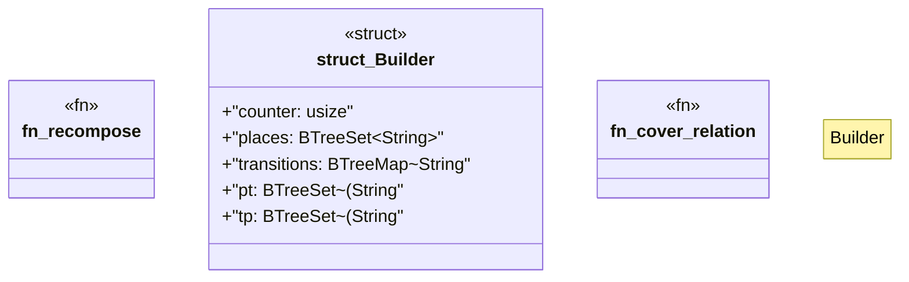

# `crates/powl2-decompose/src/recompose.rs`

Source SHA-256: `704a2b9ad27795ce729b1e179a2e69f5282a76b82058ace6c40d6c11fe1ae34e`

## Dependencies

- `crate::net::{Label, WfNet}`
- `crate::powl::{ChoiceGraph, GNode, Powl}`
- `std::collections::{BTreeMap, BTreeSet}`

## Standing

- Structural parse: `ALIVE`
- Runtime behavior: `UNKNOWN`
