# `crates/powl2-decompose/tests/decompose_tests.rs`

Source SHA-256: `6daf053f5ea367e9ab88063e5706d0e986425b09a24c691ec0fd3a129461cb9c`

```mermaid
classDiagram
    class type_Arc {
      <<type>>
    }
    class fn_net {
      <<fn>>
    }
    class fn_lang {
      <<fn>>
    }
    class fn_assert_admits_and_roundtrips {
      <<fn>>
    }
    class fn_sequence_net {
      <<fn>>
    }
    class fn_sequence_decomposes_to_partial_order {
      <<fn>>
    }
    class fn_xor_net {
      <<fn>>
    }
    class fn_xor_decomposes_to_choice_graph {
      <<fn>>
    }
    class fn_and_net {
      <<fn>>
    }
    class fn_and_decomposes_to_partial_order_with_concurrency {
      <<fn>>
    }
    class fn_loop_net {
      <<fn>>
    }
    class fn_loop_decomposes_to_cyclic_choice_graph {
      <<fn>>
    }
    class fn_non_separable_net {
      <<fn>>
    }
    class fn_non_separable_net_is_refused_with_receipt {
      <<fn>>
    }
    class fn_decomposition_is_deterministic {
      <<fn>>
    }
    class fn_admission_matrix {
      <<fn>>
    }
```

## Dependencies

- `powl2_decompose::language::language_upto`
- `powl2_decompose::{convert, recompose, Powl, RefusalReason, Trace, WfNet}`
- `std::collections::BTreeSet`

## Standing

- Structural parse: `ALIVE`
- Runtime behavior: `UNKNOWN`
