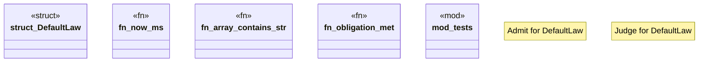

# `crates/praxis-core/src/default_law.rs`

Source SHA-256: `29fb0f251b2531a437baccb437318f0c38f923b805ea35bff35267e9fa3c04e2`

## Dependencies

- `crate::law::ReceiptMeta`
- `crate::{ law::{Admit, Andon, Judge, LawObject, Obligation}, lifecycle::{Admitted, Raw, Validated}, refusal::RefusalScenario, }`
- `serde_json::json`
- `std::time::{SystemTime, UNIX_EPOCH}`
- `super::*`

## Standing

- Structural parse: `ALIVE`
- Runtime behavior: `UNKNOWN`
