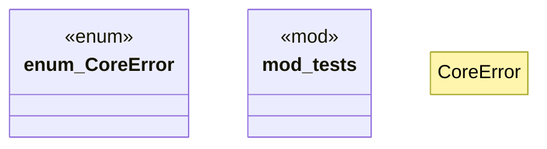

# `crates/praxis-core/src/error.rs`

Source SHA-256: `d8044756d235fcafaed6b04475f3c7415e9a48b801c20901d10f60531cdd8dac`

## Dependencies

- `crate::law::Obligation`
- `std::collections::BTreeSet`
- `super::*`
- `thiserror::Error`

## Standing

- Structural parse: `ALIVE`
- Runtime behavior: `UNKNOWN`
