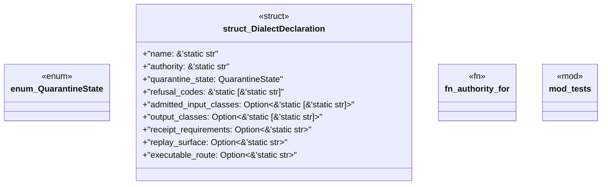

# `crates/praxis-core/src/graphlaw_authority.rs`

Source SHA-256: `a7c998c36ba250b206ed904d66fdb11b353f379fe4de597a0ccfa4d44d274cc2`

## Dependencies

- `super::*`

## Standing

- Structural parse: `ALIVE`
- Runtime behavior: `UNKNOWN`
