# `crates/praxis-core/src/law.rs`

Source SHA-256: `7f5b83f9563d4df297926e2979a7075df20271f9b35f43275b6c3d9d531dd304`

```mermaid
classDiagram
    class enum_Obligation {
      <<enum>>
    }
    class enum_Andon {
      <<enum>>
    }
    class struct_LawObject {
      <<struct>>
      +"payload: Payload"
      +"obligations: Vec~Obligation~"
      +"andon: Andon"
      +"chain_hash: Option~[u8; 32]~"
      +"signature: Option~Vec~u8~~"
      +"_stage: PhantomData~S~"
      +"_law: PhantomData~Law~"
    }
    class trait_Judge {
      <<trait>>
      +"judge(
        raw: LawObject~Self::Payload, Raw, Self::Law~,
    ) -~ Result~"
    }
    class trait_Admit {
      <<trait>>
      +"admit(
        validated: LawObject~Self::Payload, Validated, Self::Law~,
    ) -~ Result~LawObject~Self::Payload, Admitted, Self::Law~, Andon~"
    }
    class struct_ReceiptMeta {
      <<struct>>
      +"instruction_id: u64"
      +"activity_idx: u16"
      +"node_kind: u8"
      +"ts_ns: Option~u64~"
      +"denial: DenialPolarity"
      +"andon: Andon"
      +"object_ids: Vec~String~"
      +"obligation_count: u32"
    }
    class fn_build_admission_frame {
      <<fn>>
    }
    class fn_chain_from_frame {
      <<fn>>
    }
    class mod_tests {
      <<mod>>
    }
    note "Default for ReceiptMeta"
    note "LawObject~Payload"
    note "TryFrom~Obligation~ for wasm4pm_compat::pddl::Precondition"
```

## Dependencies

- `bcinr_powl_receipt::denial::DenialPolarity`
- `bcinr_powl_receipt::{ causal_receipt::{OcelCausalFrame, OcelCausalReceipt, PackedObjRef}, denial::DenialPolarity, }`
- `crate::lifecycle::Admitted`
- `crate::lifecycle::{sealed::Stage, Admitted, Raw, Receipted, Validated}`
- `serde::{Deserialize, Serialize}`
- `std::{ marker::PhantomData, time::{SystemTime, UNIX_EPOCH}, }`
- `super::*`

## Standing

- Structural parse: `ALIVE`
- Runtime behavior: `UNKNOWN`
