# `crates/praxis-core/src/lib.rs`

Source SHA-256: `14abdfa4135a26a8c855f2b5b272e51ed2478c19166b0ec01858ea80346320ce`

```mermaid
classDiagram
    class mod_default_law {
      <<mod>>
    }
    class mod_error {
      <<mod>>
    }
    class mod_graphlaw_authority {
      <<mod>>
    }
    class mod_law {
      <<mod>>
    }
    class mod_lifecycle {
      <<mod>>
    }
    class mod_ocel_export {
      <<mod>>
    }
    class mod_quarantine {
      <<mod>>
    }
    class mod_receipt_epoch {
      <<mod>>
    }
    class mod_receipt_record {
      <<mod>>
    }
    class mod_receipt_store {
      <<mod>>
    }
    class mod_receipt_validator {
      <<mod>>
    }
    class mod_refusal {
      <<mod>>
    }
    class mod_replay_adapter {
      <<mod>>
    }
    class mod_verify {
      <<mod>>
    }
    class mod_ocel {
      <<mod>>
    }
```

## Dependencies

- `default_law::DefaultLaw`
- `law::{Admit, Andon, Judge, LawObject, Obligation}`
- `quarantine::{BoundarySchema, JsonBoundarySchema, QuarantineError, RiceQuarantine}`
- `receipt_epoch::{read_receipt_epoch, ReceiptEpochV2, SCHEMA_V1, SCHEMA_V2}`
- `receipt_record::ReceiptRecord`
- `receipt_store::ReceiptStore`
- `receipt_validator::{Clock, FixedClock, ReceiptValidator, SystemClock, Verdict}`
- `refusal::{ compose_denials, denial_lane, scenario_for_denial_lane, RefusalCategory, RefusalScenario, }`

## Standing

- Structural parse: `ALIVE`
- Runtime behavior: `UNKNOWN`
