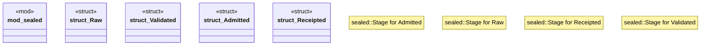

# `crates/praxis-core/src/lifecycle.rs`

Source SHA-256: `0df4f00c5a81376ff542588361aa11f523f29cb0510f076787edd8494eabdb4c`

## Dependencies

- None observed.

## Standing

- Structural parse: `ALIVE`
- Runtime behavior: `UNKNOWN`
