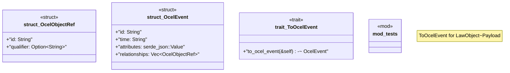

# `crates/praxis-core/src/ocel.rs`

Source SHA-256: `34d91882b58bb48e4252ba6ecc1d0ec5658d20ba7cc51352ef6724c9c9053650`

## Dependencies

- `crate::{law::LawObject, lifecycle::Receipted}`
- `crate::{lifecycle::Raw, Admit, DefaultLaw, Judge}`
- `serde::{Deserialize, Serialize}`
- `super::*`

## Standing

- Structural parse: `ALIVE`
- Runtime behavior: `UNKNOWN`
