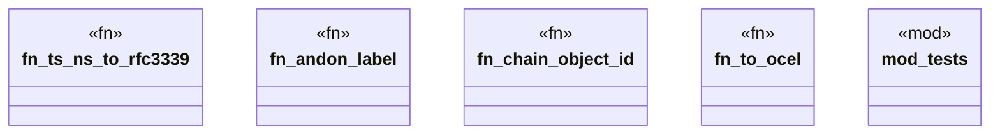

# `crates/praxis-core/src/ocel_export.rs`

Source SHA-256: `0dfc251aa249066a750e67cddc741db62dc8fe5a21fd82eb7da11ccd8909c3e5`

## Dependencies

- `chrono::{DateTime, FixedOffset, TimeZone, Utc}`
- `crate::{law::Andon, receipt_record::ReceiptRecord}`
- `std::collections::BTreeSet`
- `super::*`
- `wasm4pm_compat::ocel::{ OCELEvent, OCELEventAttribute, OCELObject, OCELRelationship, OCELType, OCEL, }`

## Standing

- Structural parse: `ALIVE`
- Runtime behavior: `UNKNOWN`
