# `crates/praxis-core/src/quarantine.rs`

Source SHA-256: `d99ef386dd0398724b1b9d211e1b5f42d330469fa31703360541c5d4fcb84a17`

```mermaid
classDiagram
    class enum_QuarantineError {
      <<enum>>
    }
    class trait_BoundarySchema {
      <<trait>>
      +"validate(&self, observation: &str) -~ Result~T, QuarantineError~"
    }
    class struct_RiceQuarantine {
      <<struct>>
      +"schema: S"
      +"_payload: std::marker::PhantomData~P~"
    }
    class struct_JsonBoundarySchema {
      <<struct>>
      +"predicate: Option~F~"
      +"_payload: std::marker::PhantomData~T~"
    }
    class mod_tests {
      <<mod>>
    }
    note "BoundarySchema~T~ for JsonBoundarySchema~T"
    note "Default for JsonBoundarySchema~T"
    note "JsonBoundarySchema~T"
    note "RiceQuarantine~S"
```

## Dependencies

- `crate::{ law::{LawObject, Obligation}, lifecycle::Raw, }`
- `serde::{de::DeserializeOwned, Deserialize, Serialize}`
- `super::*`
- `thiserror::Error`

## Standing

- Structural parse: `ALIVE`
- Runtime behavior: `UNKNOWN`
