# `crates/praxis-core/src/receipt_epoch.rs`

Source SHA-256: `2b2464adae5f97bea00d90c3f6ac290c1b5126dc66729f074ec232576dd26ae7`

```mermaid
classDiagram
    class fn_default_schema {
      <<fn>>
    }
    class enum_AndonLevel {
      <<enum>>
    }
    class enum_CeilingLevel {
      <<enum>>
    }
    class struct_ComponentLevels {
      <<struct>>
      +"lint: AndonLevel"
      +"test: AndonLevel"
      +"fmt: AndonLevel"
      +"gate: AndonLevel"
    }
    class fn_supported {
      <<fn>>
    }
    class fn_recoverable {
      <<fn>>
    }
    class fn_compute_ceiling {
      <<fn>>
    }
    class enum_EquivalenceStatus {
      <<enum>>
    }
    class struct_EquivalenceMap {
      <<struct>>
      +"source: EquivalenceStatus"
      +"compiled_binary: EquivalenceStatus"
      +"docs: EquivalenceStatus"
      +"tests: EquivalenceStatus"
      +"receipts: EquivalenceStatus"
      +"evidence: EquivalenceStatus"
      +"gates: EquivalenceStatus"
      +"config: EquivalenceStatus"
    }
    class enum_ObservedOutcome {
      <<enum>>
    }
    class enum_AdmissionDecision {
      <<enum>>
    }
    class struct_AdmissionItem {
      <<struct>>
      +"evidence_id: String"
      +"observed_outcome: ObservedOutcome"
      +"decision: AdmissionDecision"
      +"reason: String"
      +"obligations_discharged: Vec~String~"
      +"obligations_created: Vec~String~"
    }
    class enum_AdmissionLedger {
      <<enum>>
    }
    class fn_derive_andon {
      <<fn>>
    }
    class enum_ObligationCount {
      <<enum>>
    }
    class fn_compute_obligation_count {
      <<fn>>
    }
    class struct_ReceiptEpochV2 {
      <<struct>>
      +"admission: AdmissionLedger"
      +"standing_ceiling: CeilingLevel"
      +"equivalence: EquivalenceMap"
      +"obligation_count: ObligationCount"
      +"andon: AndonLevel"
      +"promotion_eligible: bool"
    }
    class struct_PromotionWitness {
      <<struct>>
      +"from_ceiling: CeilingLevel"
      +"to_ceiling: CeilingLevel"
      +"evidence_receipts: Vec~String~"
      +"closed_obligations: Vec~String~"
      +"verifier_identity: String"
      +"authorization_basis: String"
    }
    class fn_validate_promotion {
      <<fn>>
    }
    class struct_ReceiptEpochV2Builder {
      <<struct>>
      +"prev_ceiling: CeilingLevel"
      +"components: ComponentLevels"
      +"admission: Vec~AdmissionItem~"
      +"equivalence: EquivalenceMap"
      +"explicit_ceiling: Option~CeilingLevel~"
      +"promoted: bool"
    }
    class fn_read_receipt_epoch {
      <<fn>>
    }
    class struct_ReceiptRecordV1Legacy {
      <<struct>>
      +"version: u32"
      +"instruction_id: u64"
      +"activity_idx: u16"
      +"activity: Option~String~"
      +"node_kind: u8"
      +"ts_ns: u64"
      +"duration_ms: Option~u64~"
      +"payload_hash_hex: String"
      +"prev_chain_hash_hex: String"
      +"chain_hash_hex: String"
      +"andon: crate::law::Andon"
      +"obligation_count: u32"
      +"object_ids: Vec~String~"
      +"signature_hex: Option~String~"
    }
    class struct_MigrationReceipt {
      <<struct>>
      +"migration_law: String"
      +"from_schema: String"
      +"to_schema: String"
      +"final_v1_chain_hash_hex: String"
      +"first_v2_chain_hash_hex: String"
      +"carries_forward: Vec~String~"
      +"becomes_unknown: Vec~String~"
      +"resulting_ceiling: CeilingLevel"
    }
    class mod_tests {
      <<mod>>
    }
    note "AdmissionDecision"
    note "AdmissionItem"
    note "ComponentLevels"
    note "EquivalenceMap"
    note "From~AndonLevel~ for CeilingLevel"
    note "MigrationReceipt"
    note "ObligationCount"
    note "ReceiptEpochV2"
    note "ReceiptEpochV2Builder"
```

## Dependencies

- `crate::error::CoreError`
- `serde::{Deserialize, Serialize}`
- `super::*`

## Standing

- Structural parse: `ALIVE`
- Runtime behavior: `UNKNOWN`
