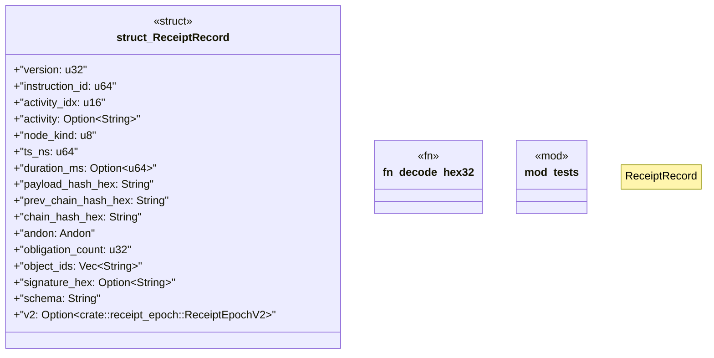

# `crates/praxis-core/src/receipt_record.rs`

Source SHA-256: `8083626c0b268b060534c320912526587107f30f221cd3be7feb98012df005e8`

## Dependencies

- `crate::{ error::CoreError, law::{build_admission_frame, chain_from_frame, Andon, ReceiptMeta}, }`
- `serde::{Deserialize, Serialize}`
- `super::*`

## Standing

- Structural parse: `ALIVE`
- Runtime behavior: `UNKNOWN`
