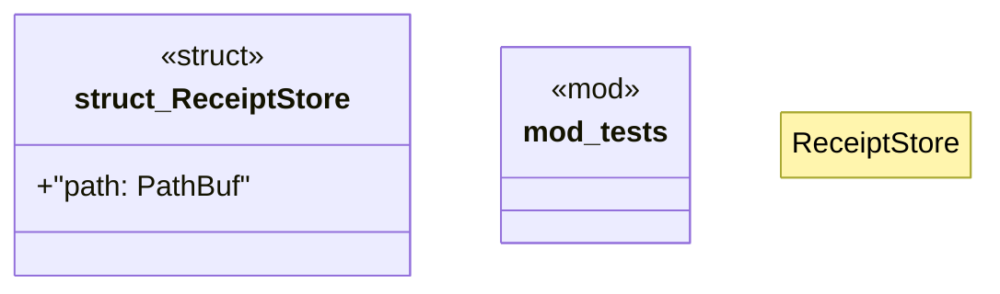

# `crates/praxis-core/src/receipt_store.rs`

Source SHA-256: `03bb8ea4b96170cca37b2c2753780d349c525822010ec42fa3875d4d243017dd`

## Dependencies

- `crate::law::Andon`
- `crate::{error::CoreError, receipt_record::ReceiptRecord}`
- `std::{ fs::OpenOptions, io::Write as _, path::{Path, PathBuf}, }`
- `super::*`

## Standing

- Structural parse: `ALIVE`
- Runtime behavior: `UNKNOWN`
