# `crates/praxis-core/src/receipt_validator.rs`

Source SHA-256: `95ea540cfbe3d291089ec5655c06079f493e9fe776bc9b78184dde0be6ee3368`

```mermaid
classDiagram
    class trait_Clock {
      <<trait>>
      +"now_ns(&self) -~ u64"
    }
    class struct_SystemClock {
      <<struct>>
    }
    class struct_FixedClock {
      <<struct>>
    }
    class enum_CheckOutcome {
      <<enum>>
    }
    class struct_StageResult {
      <<struct>>
      +"stage: String"
      +"outcome: CheckOutcome"
    }
    class struct_Verdict {
      <<struct>>
      +"ok: bool"
      +"stages: Vec~StageResult~"
      +"records_checked: usize"
    }
    class struct_ReceiptValidator {
      <<struct>>
    }
    class mod_tests {
      <<mod>>
    }
    note "CheckOutcome"
    note "Clock for FixedClock"
    note "Clock for SystemClock"
    note "ReceiptValidator"
    note "StageResult"
```

## Dependencies

- `crate::law::Andon`
- `crate::{receipt_record::ReceiptRecord, replay_adapter}`
- `serde::{Deserialize, Serialize}`
- `std::time::{SystemTime, UNIX_EPOCH}`
- `super::*`

## Standing

- Structural parse: `ALIVE`
- Runtime behavior: `UNKNOWN`
