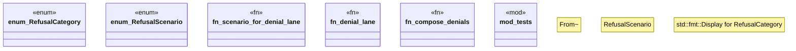

# `crates/praxis-core/src/refusal.rs`

Source SHA-256: `5b44f130670649cd41f5e53a963b1b93b2a255682a7ce3a84f2c0a078508a6ee`

## Dependencies

- `bcinr_powl_receipt::denial::DenialPolarity`
- `crate::law::Obligation`
- `serde::{Deserialize, Serialize}`
- `super::*`

## Standing

- Structural parse: `ALIVE`
- Runtime behavior: `UNKNOWN`
