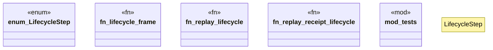

# `crates/praxis-core/src/replay_adapter.rs`

Source SHA-256: `1521577dbd3fecbfa60f18f5e92f7dd70008c8f13e72e39037db24b7dcdef04c`

## Dependencies

- `bcinr_powl_receipt::{ conformance::ConformanceMetrics, replay::{PowlReplayFrame, PowlReplayVerifier, ReplayViolation}, }`
- `crate::receipt_record::ReceiptRecord`
- `super::*`

## Standing

- Structural parse: `ALIVE`
- Runtime behavior: `UNKNOWN`
